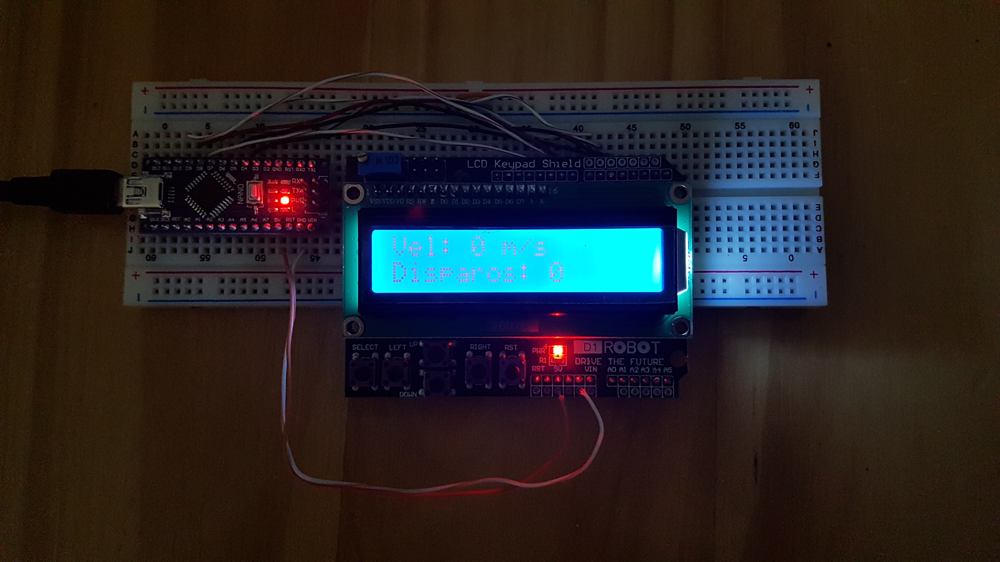
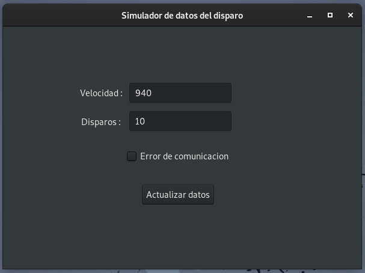
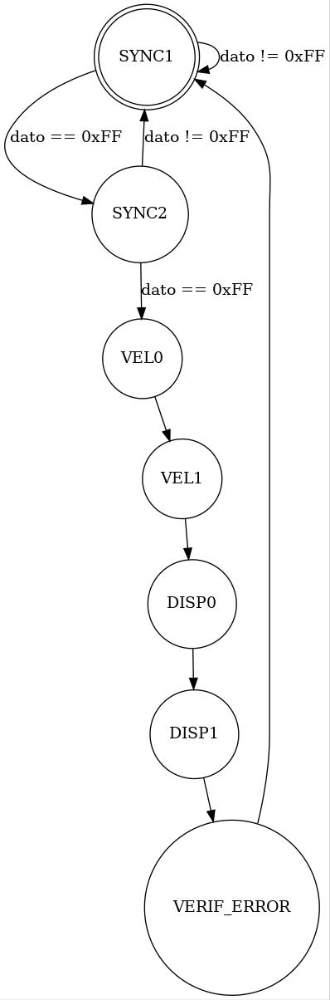

Dispositivo para la visualización de datos (velocidad y cantidad) del disparo de un cañon.
------------------------------------------------------------------------------------------

En este trabajo se realizaron dos tareas fundamentales:

* El desarrollo de un software con interfaz gráfica, en lenguaje C#, 
para simular la trama que transmite el dispositivo que mide la velocidad 
y cantidad de disparos del cañon. La interfaz gráfica del software 
permite cargar los datos de velocidad y cantidad de disparos, y además 
simular los errores de comunicación. 

* El desarrollo del firmware para un Arduino Nano, que permite decodificar 
la trama y visualizar los datos en un display LCD.  

Maquina de estados para la decodificación de la trama
-----------------------------------------------------

